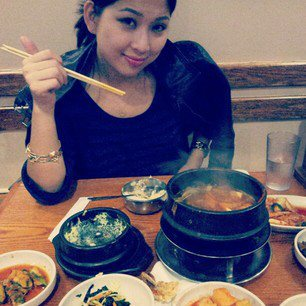

 

##### __**My Motos in Life**__
    * Enjoy and Have Fun, Live According to Values, Contribute to Improving Human Conditions


##### __Background__
    * Grew up in Seoul, Korea
    * Lived in Chicago, Ithaca, Los Angeles, Geneva (Switzerland), Washington DC and now South Florida
    
##### __Favorite Things__
    * Being Active and Healthty
         * Jogging, Weightlifting, Biking, Paleo Cooking
         
    * Learning New Things
        * ARR!
        * Buddhism & Meditations
        * Salsa Dancing
        * Guitar
        
    * Reading Books
    
    * Mentoring Youth and Tutoring Math

##### __Professional Background__
    * Mid Term Goal - 
          * Pursue Intersting and Impactful Career in Data Analysis and Research 
          * Aim to Enroll in a MA program for Biostatistics (and maybe phD) 
      
    * Education 
          * Labor Economics from Cornell University
          
    * Experience
          * Lead Data Analyst at Envision Healthcare
          * Research Associate at AFL-CIO in Washington DC
          * Researcher at United Nations 
          
    * Computer Skills
          * Programming Languages: SQL, DAX
          * Familiar Softwares: Excel, Power BI, Tableau, SSAS, Visual Studio
          
    * Other Skills
          * Fluent in Korean and English, and Intermediate Training in Japanese and French
          
          
```{r}
# I'm learning data science! Woohoo~ !
```
